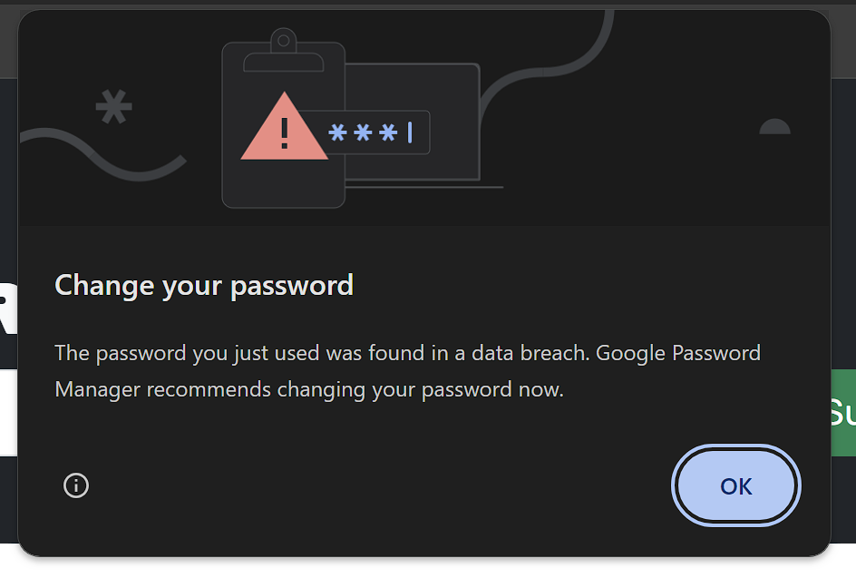

# Refactor | Book Search Engine - GraphQL

## Description

This project is a refactor of a book search engine, originally built with a RESTful API, now utilizing GraphQL with Apollo Server. Constructed using the MERN stack (MongoDB, Express, React, Node.js), it allows users to seamlessly search for books and maintain a personal list of their favorite reads.

## Table of Contents

- [Installation](#installation)
- [Usage](#usage)
- [Features](#features)
- [Technologies](#technologies)
- [Issues](#issues)
- [License](#license)
- [Questions](#questions)

## Installation

1. Clone this repository to your local machine.
2. Navigate to the root directory in your terminal.
3. Install the necessary dependencies by running `npm install`.

## Usage

1. Open your preferred code editor and navigate to the project directory.
2. In the terminal, navigate to the server directory.
3. Run `npm run develop` in the terminal to start both the client and server.
4. Open your browser and go to http://localhost:3000 to start exploring.

## Features

- **User Authentication**: Secure login and signup with JWT.
- **Book Search**: Find books using the powerful Google Books API.
- **Save Books**: Add books to your personal collection.
- **View Saved Books**: Easily access all your saved books in one place.
- **Remove Books**: Delete books from your list any time.

## Technologies

- **MongoDB**: For our database needs.
- **Express.js**: Handles the server-side logic.
- **React.js**: Powers the dynamic front end.
- **Node.js**: Our server environment.
- **GraphQL**: Enables efficient and flexible data querying.
- **Apollo Server**: Our GraphQL server.

## Issues

This is a known bug and will be fixed soon.

## License

This project is open-source and available under the MIT License.

## Questions

If you have any questions or run into any issues, feel free to [contact me](garibay_r18@yahoo.com).
